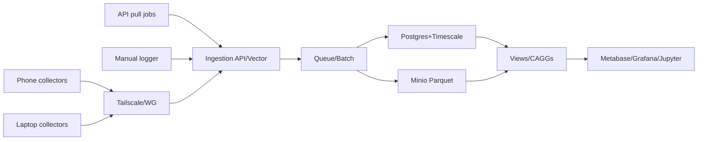

# Personal Data Capture (Self-Hosted, Private)

- Foundation: self-hosted stack (docker-compose) with `postgres+timescale` for metadata, `minio` for raw blobs/parquet, `vector`/`fluent-bit` or lightweight ingestion API (FastAPI/Next API route) fronted by `tailscale`/`wireguard`.
- Privacy/encryption: device collectors encrypt-to-public-key before send (age/pgp); server stores ciphertext at rest (LUKS/dm-crypt on volume + S3 SSE for Minio); rotate keys and keep audit logs. Network via HTTPS + VPN; no third-party SaaS.
- Data model: append-only `events` table (`id, source, kind, ts, payload_jsonb, hash, signature`); blob references to parquet in Minio per source/day; source-specific views (location, notifications, browser_history, app_usage, calendar, email, fitness, finance, mood, meals, timeblocks).
- Collection: 
  - Phone: Android: ActivityWatch + GPS logger + Health Connect export; iOS: Shortcuts automations -> HTTPS webhook; both: notify ingestion via VPN.
  - Computer: ActivityWatch for app/window usage, Hammerspoon/Autohotkey for keystat counters (no content), browser extension to log tabs/URLs locally then batch send.
  - Online APIs: cron jobs pulling Google Calendar/Tasks, Gmail headers, bank/fitness APIs; store tokens encrypted (age) and refresh in jobs worker.
  - Manual: simple Tauri/Electron or CLI form writing JSON to local queue; optional Obsidian/markdown frontmatter parser.
- Processing: nightly compaction to parquet per source/day; dedupe by hash, schema validation, and lightweight anomaly checks; build derived timelines and metrics in Postgres/Timescale continuous aggregates.
- Access: local Superset/Metabase on read-only replica; Grafana for timelines; Jupyter/Polars for ad-hoc; exports via signed URLs from Minio.
- Safety/ops: backups (pg_dump + Minio versioning) to offline disk; health checks and alerting only locally (ntfy/self-hosted). Minimal egress.

